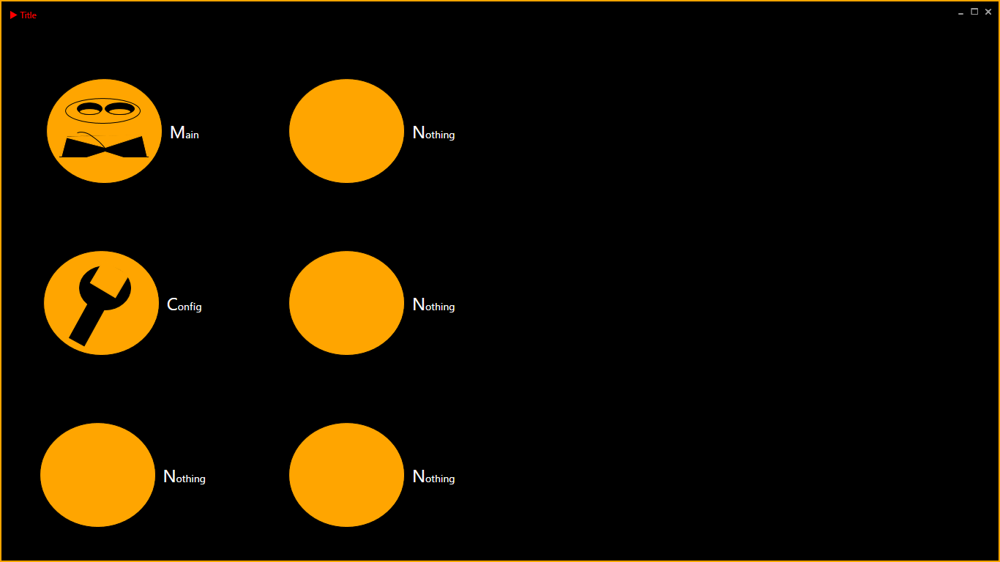

# RssReaderForReferenceDatabase

This is RssReader.  
Powered by C#(WPF). 
And Codebehind doesn't exist in this project.  
I follow MVVM.This is 100 percent MVVM.  
And please note that the app target is only "http://crd.ndl.go.jp/reference/".  

This is title.

This is main menu.

